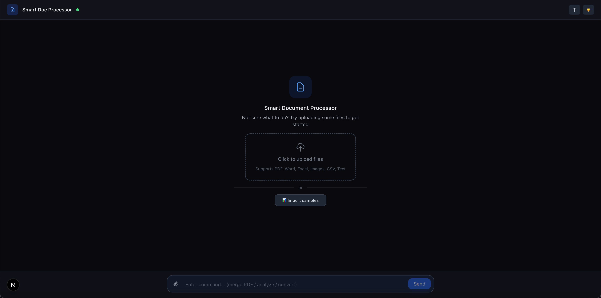

# Multimodal Processor

**Language:** English | [简体中文](./README_zh-CN.md)

AI-powered document processing agent that analyzes files (images, PDFs, CSVs, video, text) and performs interactive operations via sandbox execution. Built on the Claude Agent SDK and deployed on EdgeOne Makers.

**Framework:** None (raw Node.js) · **Category:** File Processing · **Language:** TypeScript

[](https://edgeone.ai/makers/new?template=multimodal-processor-edgeone&from=within&fromAgent=1&agentLang=typescript)

<!-- TODO: confirm -->


## Overview

This template turns uploaded files into actionable insights and transformed outputs. It auto-detects file types, loads specialized processing skills, runs Python and shell commands inside a secure sandbox, and delivers generated files back to the user. A dual MCP server architecture exposes both sandbox tools (code interpreter, commands, file I/O) and custom UI tools (action suggestions, file delivery) to the AI agent.

- **Skills-Based Analysis** — Dynamically loads file-type-specific skills (image, CSV, PDF, Word, Excel, video, text) to tailor the system prompt and available operations.
- **Sandbox Execution** — Runs Python (Pillow, pandas, matplotlib) and shell commands (ffprobe, ffmpeg) in an EdgeOne sandbox with automatic credential injection.
- **Interactive Actions** — After analysis, the agent presents clickable action cards via the `suggest_actions` custom tool; processed files are delivered via `deliver_file`.
- **Session File Cache** — Uploaded files persist across follow-up requests within the same conversation via an in-process cache that re-uploads to the sandbox on every turn.
- **Bilingual UI** — Full Chinese / English interface with locale-aware AI output.

## Environment Variables

| Variable | Required | Description |
|----------|----------|-------------|
| `AI_GATEWAY_API_KEY` | Yes | Model gateway API key. Use your Makers Models API Key, or any OpenAI-compatible provider key. |
| `AI_GATEWAY_BASE_URL` | Yes | Gateway base URL. For Makers Models, use `https://ai-gateway.edgeone.link/v1`. |


This template follows the OpenAI-compatible standard — point these at Makers Models or any compatible provider.

### How to get AI_GATEWAY_API_KEY

1. Open the Makers Console (https://console.cloud.tencent.com/edgeone/makers)
2. Sign in and enable Makers
3. Go to Makers → Models → API Key and create a key
4. Copy it into `AI_GATEWAY_API_KEY`

> Built-in models are free within quota and great for validation. For production, bind your own paid provider key (BYOK).

## Local Development

**Prerequisites**
- Node.js 18+
- EdgeOne CLI (`npm i -g @edgeone/cli`)

```bash
npm install
cp .env.example .env
# Edit .env with your AI_GATEWAY_API_KEY and AI_GATEWAY_BASE_URL
edgeone makers dev
```

Open the local observability dashboard at http://localhost:8080/agent-metrics.

## Project Structure

```
multimodal-processor-edgeone/
├── agents/
│   ├── chat/
│   │   ├── index.ts      # POST /chat — main agent: session mgmt, file upload, SSE loop
│   │   ├── skills.ts     # Dynamic system prompt builder per file type
│   │   ├── templates.ts  # PDF/chart Python templates (CJK font support)
│   │   └── tools.ts      # Shell quoting, fallback file inlining, default actions
│   ├── stop/             # POST /stop — abort active run
│   ├── _model.ts         # Model name resolution, gateway env mapping
│   └── _shared.ts        # SSE helpers, logger
├── cloud-functions/
│   └── health/           # GET /health
├── app/                  # Next.js App Router frontend
├── lib/
│   └── i18n.tsx          # Chinese / English translations
└── edgeone.json          # EdgeOne deployment config
```

Files prefixed with `_` are private modules — not exposed as public routes.

## How It Works

### Runtime Mode
Files under `agents/` run in **session mode**: requests with the same `conversation_id` are sticky-routed to the same agent instance and the same sandbox. This ensures uploaded files and sandbox state remain available across follow-up messages.

### End-to-End Workflow

1. **File upload** — The frontend encodes files as base64 and POSTs `{ message, files, conversationId }` to `/chat`.
2. **Session cache** — Files are merged into a per-conversation in-process cache so they survive across follow-up turns.
3. **Sandbox write** — The handler writes cached files to `/tmp/` in the EdgeOne sandbox using base64 decode (shell or Python fallback).
4. **Skill selection** — The system prompt is built dynamically based on uploaded file types (image, CSV, PDF, Word, Excel, video, text, or mixed).
5. **Agent loop** — The Claude Agent SDK `query()` loop drives the LLM with two MCP servers:
   - **EdgeOne sandbox MCP** (`context.tools.toClaudeMcpServer()`) exposes `code_interpreter`, `commands`, and file I/O tools.
   - **Custom tools MCP** exposes `suggest_actions` (UI action cards) and `deliver_file` (downloadable output).
6. **Tool execution** — The AI may run Python for data analysis, shell commands for media processing, or read/write sandbox files.
7. **SSE streaming** — Events include `text_delta` (assistant text), `tool_called` (tool start), `code_output` / `code_error` (execution results), `suggest_actions` (clickable options), and `file_output` (base64 download).
8. **Fallback** — If the sandbox is unavailable, text files are inlined directly into the prompt; binary files are skipped with a notice.

### Key Routes & Parameters
- `/chat` — Main processing endpoint. Body: `{ message, files[], conversationId }`.
- `/stop` — Cancels the active query run for a conversation.
- `conversation_id` can be passed in the request body or is provided automatically via `context.conversation_id`.

### Timeouts
No custom agent timeout is configured; the platform default applies.

## Resources

- [Makers Agents Documentation](https://edgeone.ai/makers)
- [Makers Quick Start](https://edgeone.ai/makers/docs/quickstart)
- [Makers Models](https://console.cloud.tencent.com/edgeone/makers/models)

## License

MIT
